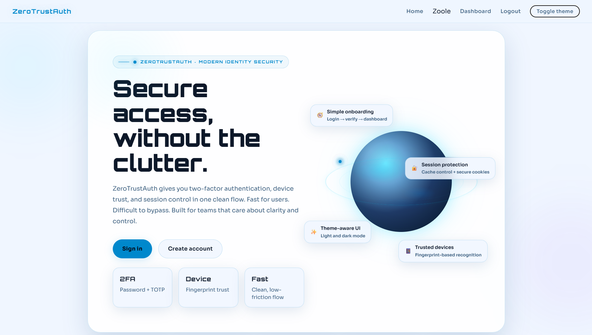
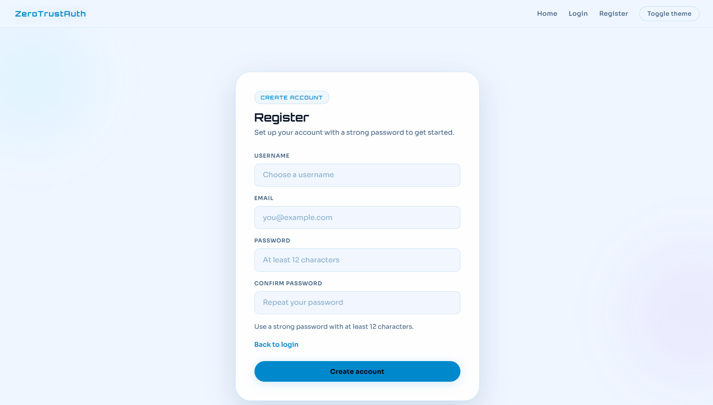
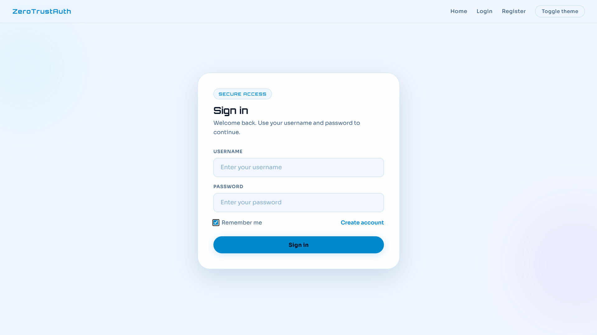
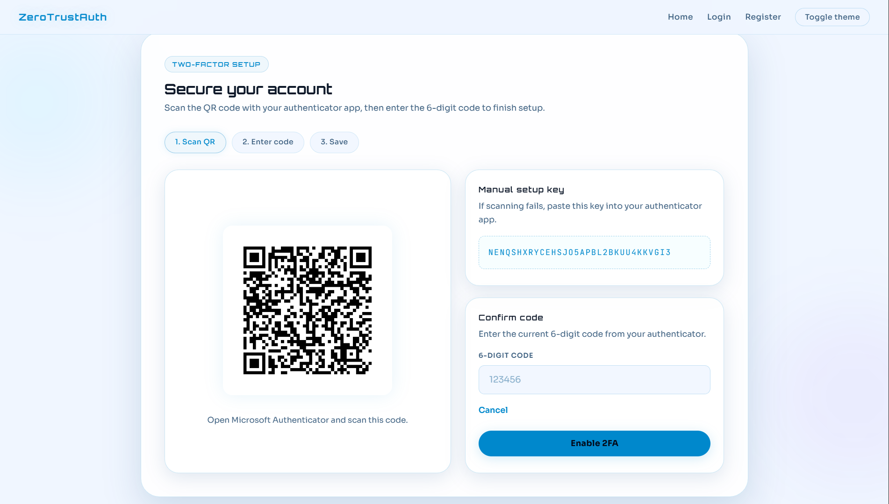
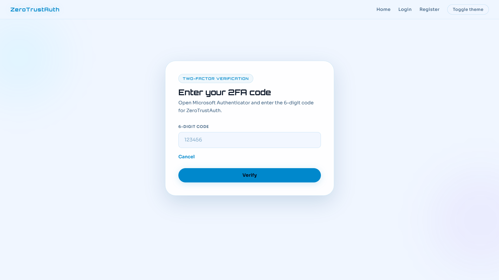
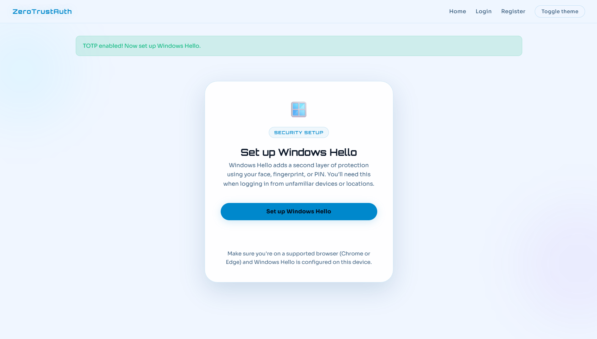
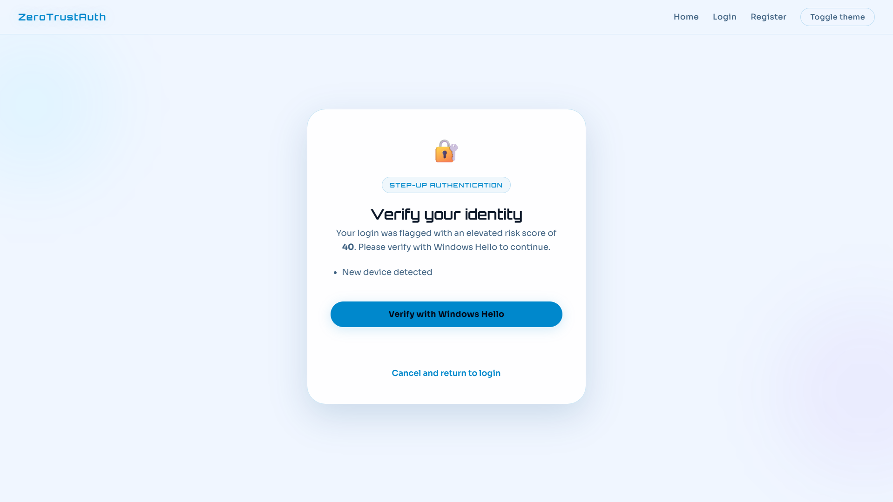
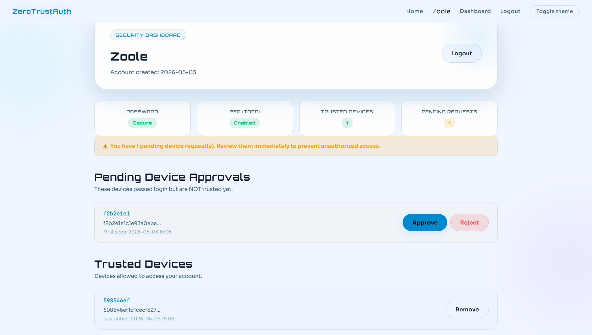
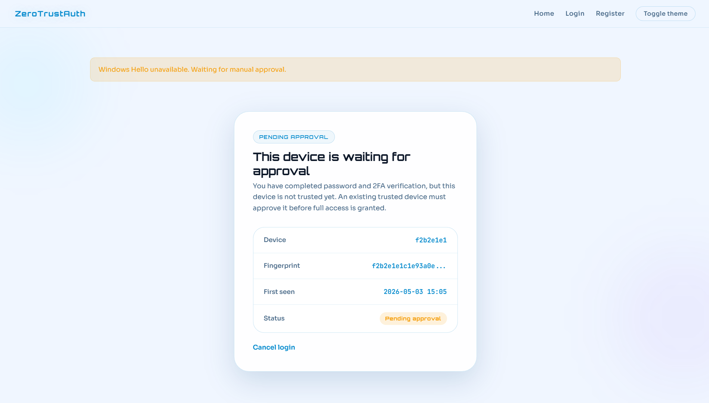
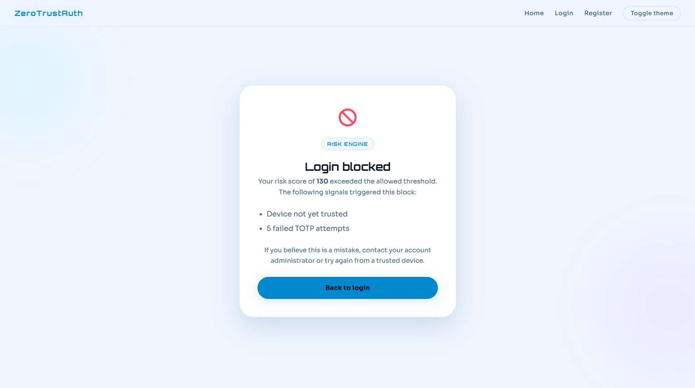

# ZeroTrustAuth

> A local-first, multi-layered authentication platform built with Flask — no cloud dependencies, no external data transmission.


<!-- Replace with your actual screenshot -->

---

## Table of Contents

- [Overview](#overview)
- [Features](#features)
- [Tech Stack](#tech-stack)
- [Project Structure](#project-structure)
- [Setup & Installation](#setup--installation)
- [Usage Guide](#usage-guide)
- [Security Architecture](#security-architecture)
- [Screenshots](#screenshots)
- [Team](#team)

---

## Overview

ZeroTrustAuth is a desktop/web authentication system that implements the **Zero Trust** security model — every login attempt is treated as potentially hostile regardless of origin. The system combines multiple layers of verification to adaptively respond to risk, requiring stronger proof of identity as suspicious signals accumulate.

All processing happens **locally on your machine**. No user data is sent to cloud services.

---

## Features

### Phase 1 — Foundation
- Secure user registration with password validation (minimum 12 characters)
- PBKDF2-SHA256 password hashing via Werkzeug
- Session management with Flask-Login
- SQLite local database — no external DB server required
- Cache-control headers to prevent sensitive page caching

### Phase 2 — Multi-Factor Authentication (TOTP)
- Time-based One-Time Passwords via `pyotp`
- QR code generation for Microsoft Authenticator setup
- Enforced on every login — cannot be skipped
- 30-second rotating codes with ±1 window for clock drift tolerance

### Phase 3 — Device Fingerprinting
- Browser-side signal collection (OS, screen, timezone, hardware, canvas rendering)
- SHA-256 hashed device identity — no raw signals stored or transmitted
- Per-user known device registry in SQLite
- New device approval flow — trusted users approve or reject unknown devices
- Server-side session token invalidation — removing a device kills its active session immediately

### Phase 4 — Risk-Based Adaptive Authentication
- Real-time risk scoring on every login attempt
- Four scored signals:
  - New device detected: **+40 points**
  - Untrusted flagged device: **+30 points**
  - Failed TOTP attempts (×3+): **+20 points each**
  - Login during unusual hours (midnight–5am UTC): **+15 points**
- Score 0–39: normal login
- Score 40–69: Windows Hello step-up required
- Score ≥ 70: login blocked with reason report

### Phase 5 — FIDO2 / WebAuthn (Windows Hello)
- Registered during account setup — mandatory for all users
- Windows Hello via PIN, facial recognition, or fingerprint
- Step-up verification triggered when risk score is 40–69
- Fallback to manual device approval if Windows Hello is cancelled
- Credential stored locally — public key only, never the biometric

---

## Tech Stack

| Layer | Technology |
|---|---|
| Backend | Python 3, Flask, Flask-Login, Flask-SQLAlchemy |
| Database | SQLite (local file, no server) |
| TOTP | pyotp |
| QR Codes | qrcode[pil] |
| WebAuthn | webauthn 2.7.1 (Duo Labs) |
| Device fingerprint | Vanilla JS + Web Crypto API (SHA-256) |
| Frontend | Jinja2 templates, CSS custom properties |

---

## Project Structure

```
zero_trust_auth/
├── app/
│   ├── __init__.py          # Flask app factory
│   ├── auth.py              # All routes and business logic
│   ├── models.py            # SQLAlchemy models
│   ├── templates/
│   │   ├── base.html
│   │   ├── home.html
│   │   ├── register.html
│   │   ├── login.html
│   │   ├── totp_setup.html
│   │   ├── totp_verify.html
│   │   ├── dashboard.html
│   │   ├── device_pending.html
│   │   ├── risk_blocked.html
│   │   ├── webauthn_register.html
│   │   └── webauthn_stepup.html
│   └── static/
│       ├── css/
│       │   └── style.css
│       └── js/
│           ├── fingerprint.js
│           ├── webauthn.js
│           └── theme.js
├── instance/
│   └── users.db             # Auto-created on first run
├── config.py
├── run.py
├── requirements.txt
└── README.md
```

---

## Setup & Installation

### Prerequisites

- Python 3.10 or higher
- pip
- A modern browser (Chrome or Edge recommended for WebAuthn)
- Windows Hello configured on your machine (PIN, face, or fingerprint)
- Microsoft Authenticator app on your phone

### 1. Clone the repository

```
git clone https://github.com/your-username/zero_trust_auth.git
cd zero_trust_auth
```

### 2. Create and activate a virtual environment

```
python -m venv venv
venv\Scripts\activate
```

### 3. Install dependencies

```
pip install -r requirements.txt
```

### 4. Create the environment file

Create a `.env` file in the project root:

```
SECRET_KEY=replace-with-a-long-random-string
DATABASE_URI=sqlite:///users.db
FLASK_ENV=development
```

### 5. Run the server

```
python run.py
```

### 6. Open in browser

```
http://localhost:5000
```

> **Important:** Always use `localhost` — not `127.0.0.1`. WebAuthn requires a valid hostname and will not work with IP addresses.

---

## Usage Guide

### First-time registration

1. Go to `http://localhost:5000/auth/register`
2. Fill in username, email, and a password of at least 12 characters
3. On the TOTP setup page, scan the QR code with **Microsoft Authenticator**
4. Enter the 6-digit code to confirm
5. Set up **Windows Hello** when prompted — enter your PIN or use facial recognition
6. You will be redirected to the dashboard

### Logging in

1. Enter username and password
2. Enter the 6-digit code from Microsoft Authenticator
3. If your risk score is 0–39 → you land on the dashboard directly
4. If your risk score is 40–69 → Windows Hello step-up is required
5. If your risk score is ≥ 70 → login is blocked with a reason report

### Managing devices

- The dashboard shows all known devices and any pending approval requests
- New devices from other browsers or machines will appear as **Pending**
- As a trusted user, you can **Approve** or **Reject** pending devices from the dashboard
- Removing a device immediately terminates its active session

### Windows Hello fallback

If Windows Hello is cancelled or unavailable on a device, the system automatically falls back to the manual device approval flow — a trusted user must approve the device from their dashboard.

---

## Security Architecture

```
Login attempt
     │
     ▼
Password check (PBKDF2-SHA256)
     │
     ▼
TOTP verification (30-second rotating code)
     │
     ▼
Device fingerprint check
     │
     ▼
Risk score calculation
     │
  ┌──┴──────────────┬─────────────────┐
  │                 │                 │
score 0-39      score 40-69       score ≥ 70
  │                 │                 │
Dashboard     Windows Hello       Blocked
              step-up              + reason
                  │                report
              Dashboard
```

### Risk signals

| Signal | Score | Trigger |
|---|---|---|
| New device | +40 | Device fingerprint not seen before |
| Untrusted device | +30 | Device exists but flagged/not approved |
| Failed TOTP | +20 × n | 3 or more wrong codes before success |
| Unusual hours | +15 | Login between midnight and 5am UTC |

### Session security

- Every login issues a unique session token stored in the database
- Token is validated on every authenticated request via `before_request`
- Removing a device sets the owner's session token to `null` — they are kicked out on their next request
- All session cookies are `HttpOnly` and `SameSite=Lax`
- No-cache headers prevent sensitive pages from being stored in browser history

---

## Screenshots

### Home


---

### Register


---


### Login


---

### TOTP Setup


---

### TOTP Verify


---

### Windows Hello Setup


---

### Windows Hello Step-up


---

### Dashboard


---

### Device Pending


---

### Risk Blocked


---

## Team

| Name | Role |
|---|---|
| **Ahmed Mohamed** | Device fingerprinting, risk-based authentication engine |
| **Marwan Hassan** | WebAuthn / FIDO2 (Windows Hello), GitHub & README |
| **Mohamed Moemen** | Flask setup, SQLite database, Microsoft Authenticator integration |

---

## License

This project was built for academic purposes as part of a university security course.
